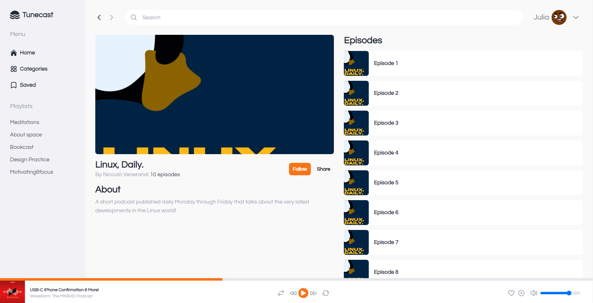

<h1 align="center">Dribbble - Tunecast</h1>

| Dribbble Shot 1 | Dribbble Shot  2 |
|:---------:|:---------:|
|  |  |
| Replica 1 | Replica 2 |
|  |  |

Replicating a <a href="https://dribbble.com/shots/19814141-Tunecast-App-Design">dribbble shot</a> I saw using React and Tailwindcss.

## TODO

- [ ] Change volume slider color with tailwind utilities only
- [ ] Implement the second shot
- [ ] Tweak the responsiveness

## About

- Icons: [Heroicons](https://heroicons.com/)
- Avatars: [DiceBear Avatars](https://avatars.dicebear.com/)
- Images: [Spotify API](https://developer.spotify.com/)